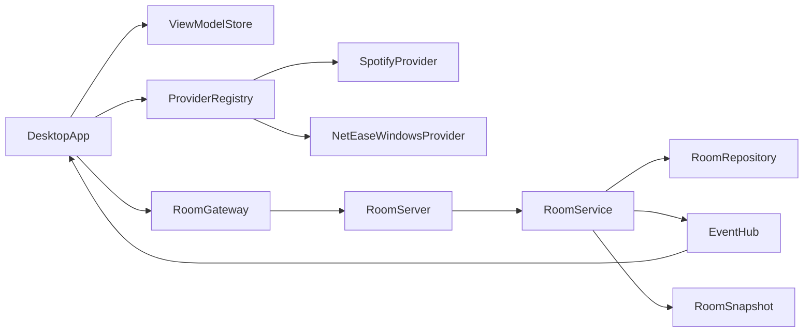

# MusicFriend 工程重构方案

## 目标

- 从“多个并行原型”收敛为“一个可持续演进的主工程”。
- 第一迭代必须完整满足你现在的核心效果：多个用户进入同一个房间后，稳定显示各自正在听的歌曲。
- 新结构要天然支持未来的房间角色、聊天、播放位审批、音频流转发、多音乐平台和跨平台扩展。
- 新文件统一采用你偏好的驼峰式命名，例如 `Main.py`、`RoomService.py`、`SpotifyProvider.py`。

## 现状诊断

当前仓库最大的问题不是代码量，而是“主路径不唯一”。

关键证据：

- 服务端当前只有单个全局内存状态，没有房间模型，见 [E:/PythonProject/MusicFriend/app.py](E:/PythonProject/MusicFriend/app.py)

```30:49:E:/PythonProject/MusicFriend/app.py
@app.route('/update_state', methods=['POST'])
def update_state():
    global room_state
    data = request.get_json()
    user = data.get('user')
    room_state[user] = {
        "song": data.get("song", ""),
        "platform": data.get("platform", "unknown"),
        "art_url": data.get("art_url"),
        "timestamp": time.time()
    }

@app.route('/get_state', methods=['GET'])
def get_state():
    cleanup_inactive_users()
    return jsonify(room_state)
```

- 桌面端把“UI、音乐检测、网络同步、聊天”全部塞进一个大脚本，见 [E:/PythonProject/MusicFriend/pure_desktop_app.py](E:/PythonProject/MusicFriend/pure_desktop_app.py)
- Web 壳、CLI、Tk 版、Windows Qt 版、macOS Qt 版同时存在，且协议不完全一致，导致后续功能每加一次都要改很多分叉文件。

## 重构原则

- 采用“旁路重构”，新架构在新目录中独立建立，旧文件先不直接删，待第一迭代跑通后再归档/移除。
- 桌面端只保留一个正式入口，禁止继续出现 Tk/CLI/Web 壳/双 Qt 实现并存。
- 服务端统一为“房间领域模型 + 实时事件协议”，不再用零散的路由和临时字典语义承载业务。
- 平台接入统一走适配层，不允许网易云/Spotify 逻辑继续散落在 UI 脚本中。
- UI、领域、网络、平台检测四层彻底拆开，保证 vibecoding 时任何一层都能独立增量改造。

## 推荐目标结构

建议把仓库重组为以下主结构：

- `apps/DesktopApp/`
  - 桌面客户端唯一正式入口。
- `apps/RoomServer/`
  - 房间服务端唯一正式入口。
- `src/MusicFriend/Domain/`
  - 领域模型、枚举、房间规则、事件定义。
- `src/MusicFriend/Contracts/`
  - Pydantic 协议模型，约束客户端和服务端的通信载荷。
- `src/MusicFriend/Integrations/`
  - Spotify、网易云、未来 QQ 音乐等平台适配器。
- `src/MusicFriend/Desktop/`
  - Qt UI、状态管理、服务网关。
- `src/MusicFriend/Server/`
  - FastAPI 应用、房间服务、仓储、实时连接管理。
- `tests/`
  - 至少覆盖领域规则和协议序列化。
- `legacy/`
  - 第一迭代稳定后，把旧入口迁移进来或直接删除。

## 推荐技术路线

### 桌面端

- 继续使用 `PySide6`，因为你已经有可运行的桌面基础，且后续 UI 功能增强、Win/Mac 统一更现实。
- 但只保留一个桌面 App，不再维护 [E:/PythonProject/MusicFriend/pure_desktop_app.py](E:/PythonProject/MusicFriend/pure_desktop_app.py) 和 [E:/PythonProject/MusicFriend/pure_desktop_app_mac.py](E:/PythonProject/MusicFriend/pure_desktop_app_mac.py) 两套分叉实现。

### 服务端

- 从 `Flask + Flask-SocketIO + eventlet` 迁移到 `FastAPI + Pydantic + WebSocket`。
- 原因：模型定义更清晰、调试更直接、对 vibecoding 更友好、未来扩展权限/房间事件/管理接口更自然。
- 第一迭代的数据层可以仍然是内存仓储，但要抽象成 `RoomRepository`，为后续 Redis/PostgreSQL 留口。

### 实时协议

- 第一迭代就统一成“房间快照 + 事件流”模型：
  - HTTP：创建/加入房间、拉取初始快照。
  - WebSocket：用户上线、离线、歌曲变化、聊天消息、角色变化、申请播放位等事件。
- 即使第一迭代先只实现“当前歌曲同步”，协议也要按未来可扩展的事件模型设计。

## 领域模型建议

第一迭代就定义这些核心对象：

- `Room`
- `Member`
- `Seat`
- `TrackState`
- `RoomSnapshot`
- `RoomEvent`
- `ClientSession`

建议未来事件类型从一开始就预留枚举：

- `memberJoined`
- `memberLeft`
- `trackUpdated`
- `chatMessageSent`
- `hostAssigned`
- `playSeatRequested`
- `playSeatApproved`
- `playSeatRejected`
- `audioStreamStarted`
- `audioStreamStopped`

这样第一迭代虽然只用到 `memberJoined`、`memberLeft`、`trackUpdated`，但后续不会再推翻协议。

## 第一迭代范围

### 目标结果

完整替代当前“同房间多人显示各自正在听的歌曲”的能力，且比现在更稳定：

- 支持用户输入昵称进入一个默认房间。
- 支持显示在线成员列表或座位卡片。
- 支持显示每个成员的 `平台 + 当前歌曲 + 封面`。
- 支持成员断线超时下线。
- Win 支持网易云和 Spotify。
- Mac 先保证 Spotify；网易云在接口上预留但不强行承诺首迭代立刻可用。

### 第一迭代不做

- 公共聊天
- 房主
- 播放位申请/审批
- 音频截取与转发
- 多房间复杂权限

### 第一迭代完成后的工程形态

- 只有一个桌面入口和一个服务端入口。
- 不再依赖 [E:/PythonProject/MusicFriend/templates/index.html](E:/PythonProject/MusicFriend/templates/index.html) 这条半成品 Web 壳链路。
- 旧的 [E:/PythonProject/MusicFriend/MusicFriend.py](E:/PythonProject/MusicFriend/MusicFriend.py)、[E:/PythonProject/MusicFriend/desktop_app.py](E:/PythonProject/MusicFriend/desktop_app.py)、[E:/PythonProject/MusicFriend/desktop_assistant.py](E:/PythonProject/MusicFriend/desktop_assistant.py) 可以进入淘汰名单。

## 未来扩展预留点

### 多用户房间与房主

- `Room` 中预留 `hostMemberId`。
- `Member` 中预留 `role` 和 `presenceState`。
- `Seat` 独立于 `Member`，以后才能支持“普通座位”和“播放位”并存。

### 公共聊天

- `RoomEvent` 中加入 `chatMessageSent`，客户端 UI 状态树中保留 `chatPanelState`。
- 服务端仓储预留聊天消息分页接口，但第一迭代可以不落库。

### 播放位审批

- 引入 `PlaySeatRequest` 实体，不直接把“是否在播放位”写死在 `Member` 上。
- 审批流走事件驱动，便于后续加房主操作面板。

### 音频转发

- 这部分不要塞进当前房间服务里。
- 未来新增 `AudioRelayService` 或 WebRTC 信令模块，与房间状态服务解耦。
- 房间服务只负责“谁拥有播放位、谁正在推流、谁订阅谁”的控制面事件。

### 多音乐平台

- 在 `src/MusicFriend/Integrations/` 下统一定义 `NowPlayingProvider` 接口。
- 首批实现：`SpotifyProvider`、`NetEaseWindowsProvider`。
- 未来新增：`QQMusicProvider`、`AppleMusicProvider`、`SystemAudioProvider`。
- 平台接入输出统一字段，不允许 UI 直接依赖第三方 API 响应。

## 迁移策略

### 阶段 A：建立新骨架

- 新建 `apps/` 与 `src/` 结构。
- 把现有逻辑拆成可复用知识来源，而不是直接复制旧大脚本。
- 可复用参考文件主要是：
  - [E:/PythonProject/MusicFriend/pure_desktop_app.py](E:/PythonProject/MusicFriend/pure_desktop_app.py)
  - [E:/PythonProject/MusicFriend/app.py](E:/PythonProject/MusicFriend/app.py)
  - [E:/PythonProject/MusicFriend/spotify_detector.py](E:/PythonProject/MusicFriend/spotify_detector.py)
  - [E:/PythonProject/MusicFriend/netease_api_utils.py](E:/PythonProject/MusicFriend/netease_api_utils.py)
  - [E:/PythonProject/MusicFriend/desktop_assistant.py](E:/PythonProject/MusicFriend/desktop_assistant.py)

### 阶段 B：先跑通第一迭代闭环

- 新桌面端检测当前歌曲。
- 新服务端维护默认房间成员快照。
- 客户端实时收到成员歌曲变化并更新 UI。
- 用新 CI/打包配置替换旧的 [E:/PythonProject/MusicFriend/.github/workflows/build.yml](E:/PythonProject/MusicFriend/.github/workflows/build.yml)。

### 阶段 C：切主路径

- 新入口稳定后，再移除旧入口和旧构建链路。
- 清理 `build/`、未使用脚本、失效模板和重复依赖文件。

## 建议保留与淘汰

### 保留思路，不保留结构

- 保留现有 Qt 房间卡片 UI 的基本交互思路。
- 保留 Spotify 和网易云的现有检测经验。
- 保留“断线超时清理”的产品逻辑。

### 优先淘汰

- [E:/PythonProject/MusicFriend/MusicFriend.py](E:/PythonProject/MusicFriend/MusicFriend.py)
- [E:/PythonProject/MusicFriend/desktop_app.py](E:/PythonProject/MusicFriend/desktop_app.py)
- [E:/PythonProject/MusicFriend/desktop_assistant.py](E:/PythonProject/MusicFriend/desktop_assistant.py)
- [E:/PythonProject/MusicFriend/pure_desktop_app_mac.py](E:/PythonProject/MusicFriend/pure_desktop_app_mac.py)
- [E:/PythonProject/MusicFriend/templates/index.html](E:/PythonProject/MusicFriend/templates/index.html)
- [E:/PythonProject/MusicFriend/static/style.css](E:/PythonProject/MusicFriend/static/style.css)
- [E:/PythonProject/MusicFriend/spotify_client.py](E:/PythonProject/MusicFriend/spotify_client.py)
- [E:/PythonProject/MusicFriend/build/](E:/PythonProject/MusicFriend/build/)

## 目标架构示意




## 我建议的实施顺序

1. 先做新服务端骨架和共享协议，不先碰复杂 UI。
2. 再做新桌面客户端最小闭环，先把“多人同房间显示歌曲”完整跑通。
3. 然后补统一 UI 状态管理和更美观的组件化界面。
4. 最后再接聊天、房主、播放位、音频能力。

这个顺序最适合 vibecoding：每一步都只有一个清晰主路径，不会继续在旧分叉上打补丁。